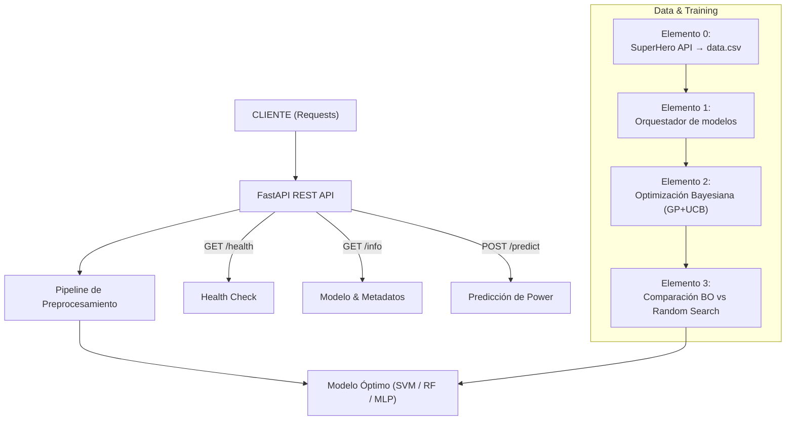

# ⚔️ Git Wars – Prediccion  de Poderes de Super Heroes con Optimización Bayesiana 


Proyecto de Machine Learning completo: **de la API de superhéroes a un modelo optimizado y desplegado en la nube**.  

Implementamos un **pipeline de ML + Optimización Bayesiana (Gaussian Process + UCB)** para predecir el atributo `power` de superhéroes, exponiendo el mejor modelo como una **API REST** containerizada con Docker y desplegada en **Render**.

> Ver Demo • Instalación • Arquitectura • BO & Modelo • Videos Tutoriales

---

## 🧾 Descripción General

Predicción del nivel de `power` de superhéroes a partir de características físicas y de combate, usando:

- Modelos de regresión clásicos (**SVM, Random Forest, MLP**)
- Una implementación **desde cero** de **Optimización Bayesiana (GP + UCB)** sobre dominios discretos de hiperparámetros
- Una **API REST** en producción que sirve predicciones en tiempo real

---

## 🎯 Objetivos Alcanzados

- ✅ Consumo de la **SuperHero API** y generación de un dataset limpio (`data/data.csv`)
- ✅ **Orquestador** de modelos (SVM, RandomForest, MLP) con interfaz común de evaluación
- ✅ **Optimización Bayesiana** sobre hiperparámetros usando **Gaussian Processes + UCB**
- ✅ Comparación **BO vs Búsqueda Aleatoria** en rendimiento y número de evaluaciones
- ✅ API REST basada en **FastAPI** para exponer el mejor modelo
- ✅ **Containerización completa** con Docker y automatización con **Makefile**
- ✅ Despliegue mediante **Render** (Infraestructura como servicio)
- ✅ Documentación y **videos tutoriales** para que cualquiera pueda replicar el flujo

---

## 🧩 Arquitectura del Sistema



---

## 🧠 Resumen de la Optimización Bayesiana (BO)

La **Optimización Bayesiana** se usa cuando evaluar la función objetivo es caro: en este caso, entrenar un modelo con ciertos hiperparámetros y medir su desempeño.

1. **Función objetivo**  
   - `f(x)` = desempeño del modelo (por ejemplo, `-RMSE`) para una configuración de hiperparámetros `x`.

2. **Modelo sustituto (surrogate)**  
   - Usamos un **Gaussian Process (GP)** con kernel **RBF** para aproximar `f(x)`.
   - El GP nos da:
     - `μ(x)` → desempeño esperado
     - `σ(x)` → incertidumbre del modelo en ese punto

3. **Función de adquisición: UCB (Upper Confidence Bound)**  
   - Seleccionamos el siguiente punto a evaluar maximizando:
   \[
   \text{UCB}(x) = \mu(x) + \kappa \, \sigma(x)
   \]
   - `κ` controla el balance **exploración vs explotación**.

4. **Ciclo BO**  
   - Elegimos algunas configuraciones iniciales al azar (exploración pura).
   - Entrenamos el modelo real (SVM / RF / MLP) y observamos `y = f(x)`.
   - Ajustamos el GP con estos datos.
   - Calculamos `UCB(x)` sobre un dominio discreto de hiperparámetros.
   - Elegimos el siguiente `x` que maximiza `UCB(x)`.
   - Repetimos hasta agotar el presupuesto de evaluaciones.

---


### Comparación BO vs Random Search (ejemplo de tabla)

| Modelo        | Mejor Métrica (BO) | Mejores Hiperparámetros (BO) | Mejor Métrica (RS) | Mejores Hiperparámetros (RS) |
|---------------|--------------------|-------------------------------|--------------------|-------------------------------|
| SVM           | 16.8363            | (C = 100.0, gamma = 0.1)      | 15.6400            | (C = 100.0, gamma = 0.01)     |
| Random Forest | 16.4791            | (n_estimators = 100, max_depth = 8) | 16.4791    | (n_estimators = 100, max_depth = 8) |
| MLP           | 38.9147            | (hidden_layer_sizes = (64,), alpha = 0.001) | 37.9094 | (hidden_layer_sizes = (64,), alpha = 0.0001) |

---

🎥 **Oprtimizacion Bayesiana**  
**Video explicacion de como funciona ** → [Ver video](<https://drive.google.com/file/d/1qTafvc1ZlTAVJ0GuLYlabed8Gg2zUfmU/view?usp=sharing>)


## 🧱 Estructura del Repositorio

```text
.
├── .github/                     # Configuración extra de GitHub (workflows, etc.)
├── api/
│   ├── main.py                  # API REST (FastAPI) con /health, /info, /predict
│   └── model/                   # Artefactos del modelo para la API
│       ├── best_svm_params.pkl
│       ├── best_trained_svm_model.pkl
│       └── preprocesador.pkl
├── data/
│   ├── data.csv                 # Dataset generado en el Elemento 0
│   ├── preprocesador.py         # Lógica de preprocesamiento (versión script)
│   └── trained_model.py         # Script para cargar/usar el modelo entrenado
├── deployments/
│   ├── Dockerfile               # Imagen Docker de la API
│   └── render.yaml              # Configuración del servicio en Render
├── notebooks/
│   └── nb_wework.ipynb          # Notebook con BO vs RS, análisis y visualizaciones
├── src/
│   ├── Elemento0/
│   │   └── get_data.py          # Consumo de SuperHero API → data.csv
│   ├── optimizer.py             # Implementación de BO (GP + UCB)
│   ├── orchestrator.py          # evaluate_svm / evaluate_rf / evaluate_mlp
│   ├── random_search.py         # Búsqueda aleatoria de hiperparámetros
│   └── utils.py                 # Funciones auxiliares
├── .gitignore
├── Makefile                     # Comandos build / run / stop / clean / package
├── README.md                    # Documentación principal del proyecto
└── requirements.txt             # Dependencias del proyecto
```


---

## 📦 Elemento 0 – Dataset desde SuperHero API

**Archivo principal:** `src/Elemento0/get_data.py`

Pasos:

1. **Consumo de la API** `https://akabab.github.io/superhero-api`  
2. **Selección de variables:**
   - `intelligence`, `strength`, `speed`, `durability`, `combat`
   - `height` y `weight` → convertidas a `height_cm`, `weight_kg`
   - Objetivo: `power`
3. **Limpieza:**
   - Conversión de unidades
   - Manejo de valores faltantes
   - Filtrado de registros inválidos
4. **Salida:** `data/data.csv` con ~600 registros.

Para regenerar el dataset:

```bash
python3 src/Elemento0/get_data.py
```

🎥 **Video relacionado:**  
**Cómo sacar data de una API** → [Ver video](<https://drive.google.com/file/d/1GB2y2Vv3NHgBvAXj7ZDdAv3P2l25bYg4/view?usp=sharing>)

---

## 🤖 Elemento 1 – Orquestador de Modelos

**Archivo:** `src/orchestrator.py`

Funciones públicas:

- `evaluate_svm(C, gamma)`
- `evaluate_rf(n_estimators, max_depth)`
- `evaluate_mlp(hidden_layer_sizes, alpha)`

Todas siguen el mismo flujo:

1. Cargan `data/data.csv`
2. Separan `X` y `y = power`
3. Aplican preprocesamiento común (escalado, etc.)
4. Entrenan el modelo con los hiperparámetros dados
5. Evalúan el desempeño sobre un conjunto de validación
6. Devuelven una métrica (por ejemplo, `RMSE` o `score` en `[0,1]`)

Ejemplo:

```python
from src.orchestrator import evaluate_svm, evaluate_rf, evaluate_mlp

print("SVM:", evaluate_svm(C=10, gamma=0.1))
print("RF:", evaluate_rf(n_estimators=100, max_depth=8))
print("MLP:", evaluate_mlp(hidden_layer_sizes=(32, 16), alpha=1e-3))
```

---

## 📈 Elemento 2 – Optimización Bayesiana (GP + UCB)

**Archivo:** `src/optimizer.py`

### Dominios de búsqueda (ejemplo)

- **SVM**
  - `C ∈ {0.1, 1, 10, 100}`
  - `gamma ∈ {0.001, 0.01, 0.1, 1}`

- **Random Forest**
  - `n_estimators ∈ {10, 20, 50, 100}`
  - `max_depth ∈ {2, 4, 6, 8}`

- **MLP**
  - `hidden_layer_sizes ∈ {(16,), (32,), (64,), (32,16)}`
  - `alpha ∈ {1e-4, 1e-3, 1e-2}`

### Funciones principales

- `rbf_kernel(X1, X2, length_scale=1.0)`
- `fit_gp(X, y, length_scale=1.0, noise=1e-6)`
- `gp_predict(X_train, y_train, X_test, length_scale=1.0, noise=1e-6)`
- `acquisition_ucb(mu, sigma, kappa=2.0)`
- `optimize_model(model_name, n_init=3, n_iter=10)`

Ejemplo de uso:

```python
from src.optimizer import optimize_model

best_params, best_metric = optimize_model(model_name="rf", n_init=3, n_iter=10)
print("Mejores hiperparámetros:", best_params)
print("Mejor métrica (BO):", best_metric)
```

---

## 🎲 Elemento 3 – Comparación BO vs Random Search

**Archivo:** `src/random_search.py`  
En el notebook `notebooks/nb_equipo_<nombre>.ipynb` se incluyen:

- Tablas comparando **mejor métrica** por modelo y método
- Curvas de evolución de la métrica vs iteraciones
- Análisis cualitativo de:
  - rapidez de convergencia
  - estabilidad de resultados
  - sensibilidad a hiperparámetros

---

## 🌐 Elemento 4 – API REST con FastAPI

**Archivo:** `api/main.py`

### Endpoints disponibles

- `GET /health` – Health Check del servicio
- `GET /info` – Información del modelo, hiperparámetros y equipo
- `POST /predict` – Predicción de `power` para un superhéroe

Ejemplo `POST /predict`:

```bash
curl -X POST http://localhost:8000/predict \
  -H "Content-Type: application/json" \
  -d '{
        "features": {
          "intelligence": 50,
          "strength": 80,
          "speed": 60,
          "durability": 70,
          "combat": 55,
          "height_cm": 185,
          "weight_kg": 90
        }
      }'
```

Respuesta esperada:

```json
{
  "prediction": 72.35
}
```

🎥 **Video relacionado:**  
**Cómo levantar una API con FastAPI** → [Ver video](<https://drive.google.com/file/d/1u-bP_8H9B_1PYbTwBD9B2PvPuf-myAd0/view?usp=sharing>)

---

## 🐳 Containerización con Docker

**Archivo:** `deployments/Dockerfile`

- Imagen basada en `python:3.11-slim`
- Install de dependencias
- Copia del código de la API
- Exposición del puerto `8000`
- Comando final: `uvicorn api.main:app --host 0.0.0.0 --port 8000`

Beneficios:

- 🚀 Despliegue reproducible
- 📦 Entorno aislado y consistente
- 🔁 Integración con `Makefile` para automatizar comandos

🎥 **Video relacionado:**  
**Como usar contenedores** → [Ver video](<https://drive.google.com/file/d/1k-yRhMLN6v3P7x92JfzVVZcme-lL1Yiv/view?usp=sharing>)

---

## ⚙️ Instalación

### Opción 1: Docker + Makefile (Recomendada)

```bash
# Clonar repositorio
git clone <URL_DEL_REPO>
cd <carpeta_del_repo>

# Construir imagen
make build

# Ejecutar contenedor
make run

# Revisar estado
make status

# Probar endpoints
curl http://localhost:8000/health
curl http://localhost:8000/info
curl `
  -Method POST `
  -Uri "http://localhost:8000/predict" `
  -Headers @{"Content-Type"="application/json"} `
  -Body '{"features": {"intelligence": 50, "strength": 80, "speed": 60, "durability": 70, "combat": 55, "height_cm": 185, "weight_kg": 90}}'
```

Para detener y limpiar:

```bash
make stop
make clean
```

Para empaquetar el proyecto (`.tar.gz`) para entrega:

```bash
make package
```

🎥 **Video relacionado:**  
**Cómo hacer un git (Fork)** → [Ver video](<https://drive.google.com/file/d/1X_ASoWUNQ2cZkBI7D5vadNPGpW9d9oJJ/view?usp=sharing>)

---

### Opción 2: Instalación Local (sin Docker)

```bash
# Crear entorno virtual
python -m venv .venv

# Activar entorno
source .venv/bin/activate       # Linux / Mac
# .venv\Scripts\activate        # Windows

# Instalar dependencias
pip install -r requirements.txt

# Ejecutar API
uvicorn api.main:app --host 0.0.0.0 --port 8000
```

---

## ☁️ Despliegue en Render

**Archivo:** `deployments/render.yaml`

Pasos generales:

1. Conectar el repositorio a Render.
2. Crear un **Web Service**:
   - Runtime: `Docker`
   - Build Command: definido por Render al detectar el Dockerfile
   - Start Command:
     ```bash
     uvicorn api.main:app --host 0.0.0.0 --port 8000
     ```
3. Esperar a que termine el build y probar:

```text
https://<subdominio-del-equipo>.onrender.com/health
https://<subdominio-del-equipo>.onrender.com/info
```


---

---

## 📊 Stack Tecnológico

| Tecnología     | Rol                           |
|----------------|-------------------------------|
| Python 3.11    | Lenguaje principal            |
| FastAPI        | API REST                      |
| scikit-learn   | Modelos de ML                 |
| NumPy / Pandas | Manejo y procesado de datos   |
| Docker         | Containerización              |
| Render         | Despliegue en la nube         |

---

## 📚 Documentación Adicional & Videos

- 🧠 **Fundamentos de Optimización Bayesiana** – _Notebook_ `notebooks/nb_equipo_<nombre>.ipynb`
- 📊 **Análisis BO vs Random Search** – tablas y gráficas en el mismo notebook

🎥 **Serie de Videos Tutoriales**

1. **Cómo hacer un git (Fork)**  
   → [Ver video](<https://drive.google.com/file/d/1X_ASoWUNQ2cZkBI7D5vadNPGpW9d9oJJ/view?usp=sharing>)
2. **Cómo sacar data de una API (SuperHero API + requests)**  
   → [Ver video](<https://drive.google.com/file/d/1GB2y2Vv3NHgBvAXj7ZDdAv3P2l25bYg4/view?usp=sharing>)
3. **Cómo levantar una API con FastAPI**  
   → [Ver video](<https://drive.google.com/file/d/1u-bP_8H9B_1PYbTwBD9B2PvPuf-myAd0/view?usp=sharing>)
4. **Optimizacion Bayesiana**  
   → [Ver video](<https://drive.google.com/file/d/1qTafvc1ZlTAVJ0GuLYlabed8Gg2zUfmU/view?usp=sharing>)
5. **Como usar los contenedores**  
   → [Ver video](<https://drive.google.com/file/d/1k-yRhMLN6v3P7x92JfzVVZcme-lL1Yiv/view?usp=sharing>)


---

## 🎓 Aprendizajes

**Hard Skills**

- ✔️ Implementación práctica de **Optimización Bayesiana (GP + UCB)**
- ✔️ Entrenamiento y evaluación de **SVM, RandomForest y MLP** para regresión
- ✔️ Construcción de **pipelines de datos** con Python / Pandas
- ✔️ Desarrollo de **APIs REST** con FastAPI
- ✔️ Containerización con **Docker** y automatización con **Makefile**
- ✔️ Despliegue de modelos en producción usando **Render**

**Soft Skills**

- 🤝 Trabajo colaborativo con Git/GitHub
- 📐 Organización y documentación de proyectos
- 🧩 Diseño de arquitectura de ML de punta a punta

---

## 👥 Equipo

- `<Asharetbe>` – 
- `<Brunofon199>` – 
- `<marianophys>` – 
- `<lukemorales13>` –
- `<1Enrique9>` – 

---

## 📜 Licencia

Este proyecto fue desarrollado como parte del **Laboratorio de Machine Learning (Git Wars – Superheroes)** y se distribuye con fines educativos.

---

## 🔗 Enlaces Útiles

- [Documentación de FastAPI](https://fastapi.tiangolo.com/)
- [Documentación de scikit-learn](https://scikit-learn.org/stable/)
- [Buenas prácticas Docker](https://docs.docker.com/develop/)
- [Render Docs](https://render.com/docs)

---

⭐ Si te gusto no olvides darle una estrella al repositorio.
